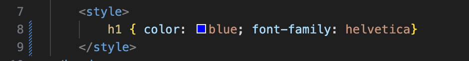

# Vad är CSS?
CSS är ett så kallat “style sheet language”, det används för att modifiera “stilen” på markup-dokument, som till exempel HTML.
CSS står för “cascading style sheet”, vilket på svenska kan kallas för en stilmall. Det är alltså en mall för hur till exempel en webbsida ska se ut. 
Det kan användas för att ändra hur exempelvis text ser ut; som färger, typsnitt, storlek.
Det kan även användas för bildramar, animationer och andra visuella element.
CSS skiljer sig från HTML, eftersom HTML är till för att strukturera information (som t.ex. text) och CSS är till för att bestämma hur text och andra grafiska element ska se ut rent visuellt. 

## Ett exempel på vad CSS är: 

I det här exemplet så kan vi se att rubriken, H1, är blå och typsnittet är Helvetica. Det här är skrivet med CSS i ett HTML-dokument. I detta exempel är det en "embedded style", eller "internal style". Det betyder att CSS-koden ligger direkt i HTML-dokumentet och påverkar bara det dokumentet.
## Linked style (external) 
Man kan även lägga sin CSS-kod i ett separat dokument i sitt git-repo (till exempel "style.css"). Fördelen med detta är delvis att man inte har all kod i samma dokument, men även att ett separat stylesheet gör det lättare att kunna länka flera HTML-dokument till samma stilmall.
## Exempel på linked styles i ett CSS-dokument: 

Exempel på hur en bakgrund kan se ut i CSS. Här kan vi bland annat se att det är en linjär övertoning (linear gradient) och vilka färger det är.

Exempel på hur en rubrik (H1) kan se ut i CSS. Här kan vi bland annat se färg, typsnitt, border (inramning) och dropshadow (skugga). 

Exempel på hur en brödtext kan se ut. Här kan vi bland annat se att det är samma typsnitt som rubriken (Helvetica), att den har en liknande dropshadow och vilken textstorlek det är.
